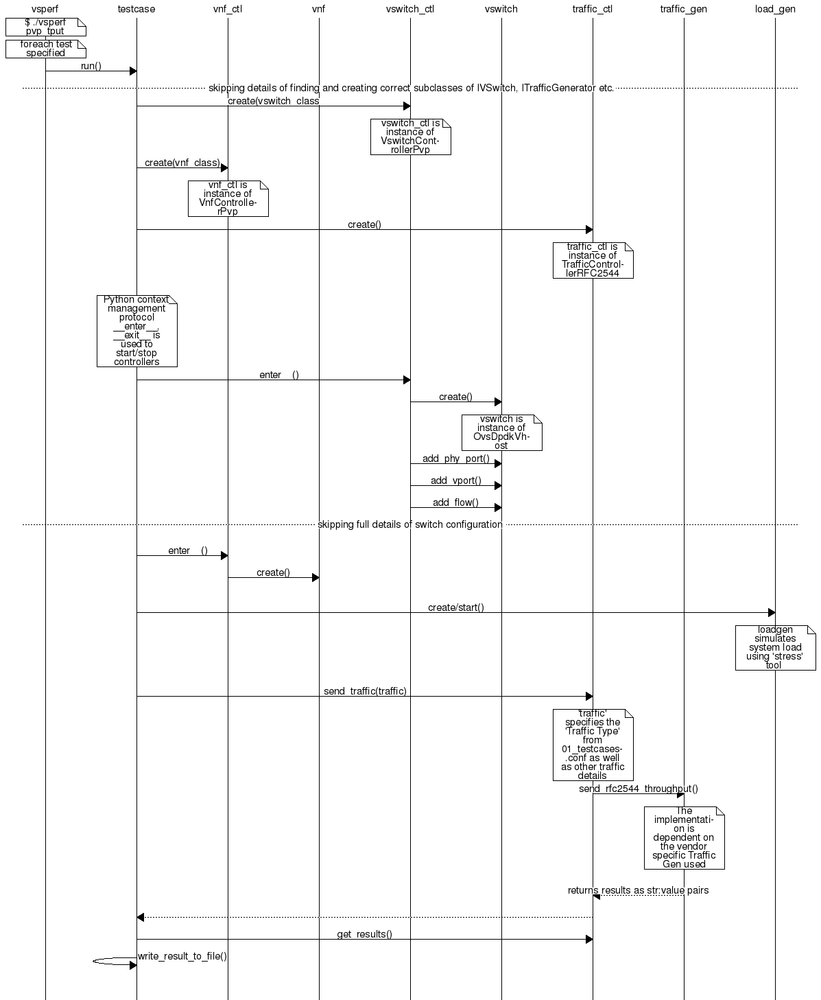

======================
VSPERF Design Document
======================

Intended Audience
=================

This document is intended to aid those who want to modify the vsperf code. Or
to extend it - for example to add support for new traffic generators,
deployment scenarios and so on.

Usage
=====

Example Command Lines
---------------------

List all the cli options:

.. code-block:: console

   $ ./vsperf -h

Run all tests that have ``tput`` in their name - ``p2p_tput``, ``pvp_tput`` etc.:

.. code-block:: console

   $ ./vsperf --tests 'tput'

As above but override default configuration with settings in '10_custom.conf'.
This is useful as modifying configuration directly in the configuration files
in ``conf/NN_*.py`` shows up as changes under git source control:

.. code-block:: console

   $ ./vsperf --conf-file=<path_to_custom_conf>/10_custom.conf --tests 'tput'

Override specific test parameters. Useful for shortening the duration of tests
for development purposes:

.. code-block:: console

   $ ./vsperf --test-params 'duration=10;rfc2544_trials=1;pkt_sizes=64' --tests 'pvp_tput'

Typical Test Sequence
=====================

This is a typical flow of control for a test.

Configuration
=============

The conf package contains the configuration files (``*.conf``) for all system
components, it also provides a ``settings`` object that exposes all of these
settings.

Settings are not passed from component to component. Rather they are available
globally to all components once they import the conf package.

.. code-block:: python

   from conf import settings
   ...
   log_file = settings.getValue('LOG_FILE_DEFAULT')

Settings files (``*.conf``) are valid python code so can be set to complex
types such as lists and dictionaries as well as scalar types:

.. code-block:: python

   first_packet_size = settings.getValue('PACKET_SIZE_LIST')[0]

Configuration Procedure and Precedence
--------------------------------------

Configuration files follow a strict naming convention that allows them to be
processed in a specific order. All the .conf files are named ``NN_name.conf``,
where NN is a decimal number. The files are processed in order from 00_name.conf
to 99_name.conf so that if the name setting is given in both a lower and higher
numbered conf file then the higher numbered file is the effective setting as it
is processed after the setting in the lower numbered file.

The values in the file specified by ``--conf-file`` takes precedence over all
the other configuration files and does not have to follow the naming
convention.

Other Configuration
-------------------

``conf.settings`` also loads configuration from the command line and from the environment.

VM, vSwitch, Traffic Generator Independence
===========================================

VSPERF supports different vSwithes, Traffic Generators, VNFs
and Forwarding Applications by using standard object-oriented polymorphism:

  * Support for vSwitches is implemented by a class inheriting from IVSwitch.
  * Support for Traffic Generators is implemented by a class inheriting from
    ITrafficGenerator.
  * Support for VNF is implemented by a class inheriting from IVNF.
  * Support for Forwarding Applications is implemented by a class inheriting
    from IPktFwd.

By dealing only with the abstract interfaces the core framework can support
many implementations of different vSwitches, Traffic Generators, VNFs
and Forwarding Applications.

IVSwitch
--------

.. code-block:: python

    class IVSwitch:
      start(self)
      stop(self)
      add_switch(switch_name)
      del_switch(switch_name)
      add_phy_port(switch_name)
      add_vport(switch_name)
      get_ports(switch_name)
      del_port(switch_name, port_name)
      add_flow(switch_name, flow)
      del_flow(switch_name, flow=None)

ITrafficGenerator
-----------------

.. code-block:: python

    class ITrafficGenerator:
      connect()
      disconnect()

      send_burst_traffic(traffic, numpkts, time, framerate)

      send_cont_traffic(traffic, time, framerate)
      start_cont_traffic(traffic, time, framerate)
      stop_cont_traffic(self):

      send_rfc2544_throughput(traffic, trials, duration, lossrate)
      start_rfc2544_throughput(traffic, trials, duration, lossrate)
      wait_rfc2544_throughput(self)

      send_rfc2544_back2back(traffic, trials, duration, lossrate)
      start_rfc2544_back2back(traffic, , trials, duration, lossrate)
      wait_rfc2544_back2back()

Note ``send_xxx()`` blocks whereas ``start_xxx()`` does not and must be followed by a subsequent call to ``wait_xxx()``.

IVnf
----

.. code-block:: python

    class IVnf:
      start(memory, cpus,
            monitor_path, shared_path_host,
            shared_path_guest, guest_prompt)
      stop()
      execute(command)
      wait(guest_prompt)
      execute_and_wait (command)

IPktFwd
--------

  .. code-block:: python

    class IPktFwd:
        start()
        stop()

Controllers
-----------

Controllers are used in conjunction with abstract interfaces as way
of decoupling the control of vSwtiches, VNFs, TrafficGenerators
and Forwarding Applications from other components.

The controlled classes provide basic primitive operations. The Controllers
sequence and co-ordinate these primitive operation in to useful actions. For
instance the vswitch_controller_PVP can be used to bring any vSwitch (that
implements the primitives defined in IVSwitch) into the configuration required
by the Phy-to-Phy  Deployment Scenario.

In order to support a new vSwitch only a new implementation of IVSwitch needs
be created for the new vSwitch to be capable of fulfilling all the Deployment
Scenarios provided for by existing or future vSwitch Controllers.

Similarly if a new Deployment Scenario is required it only needs to be written
once as a new vSwitch Controller and it will immediately be capable of
controlling all existing and future vSwitches in to that Deployment Scenario.

Similarly the Traffic Controllers can be used to co-ordinate basic operations
provided by implementers of ITrafficGenerator to provide useful tests. Though
traffic generators generally already implement full test cases i.e. they both
generate suitable traffic and analyse returned traffic in order to implement a
test which has typically been predefined in an RFC document. However the
Traffic Controller class allows for the possibility of further enhancement -
such as iterating over tests for various packet sizes or creating new tests.

Traffic Controller's Role
-------------------------

.. image:: traffic_controller.png

Loader & Component Factory
--------------------------

The working of the Loader package (which is responsible for *finding* arbitrary
classes based on configuration data) and the Component Factory which is
responsible for *choosing* the correct class for a particular situation - e.g.
Deployment Scenario can be seen in this diagram.

.. image:: factory_and_loader.png

Routing Tables
==============

Vsperf uses a standard set of routing tables in order to allow tests to easily
mix and match Deployment Scenarios (PVP, P2P topology), Tuple Matching and
Frame Modification requirements.

.. code-block:: console

      +--------------+
      |              |
      | Table 0      |  table#0 - Match table. Flows designed to force 5 & 10
      |              |  tuple matches go here.
      |              |
      +--------------+
             |
             |
             v
      +--------------+  table#1 - Routing table. Flows to route packets between
      |              |  ports goes here.
      | Table 1      |  The chosen port is communicated to subsequent tables by
      |              |  setting the metadata value to the egress port number.
      |              |  Generally this table is set-up by by the
      +--------------+  vSwitchController.
             |
             |
             v
      +--------------+  table#2 - Frame modification table. Frame modification
      |              |  flow rules are isolated in this table so that they can
      | Table 2      |  be turned on or off without affecting the routing or
      |              |  tuple-matching flow rules. This allows the frame
      |              |  modification and tuple matching required by the tests
      |              |  in the VSWITCH PERFORMANCE FOR TELCO NFV test
      +--------------+  specification to be independent of the Deployment
             |          Scenario set up by the vSwitchController.
             |
             v
      +--------------+
      |              |
      | Table 3      |  table#3 - Egress table. Egress packets on the ports
      |              |  setup in Table 1.
      +--------------+

