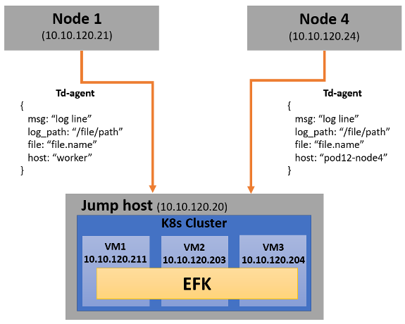
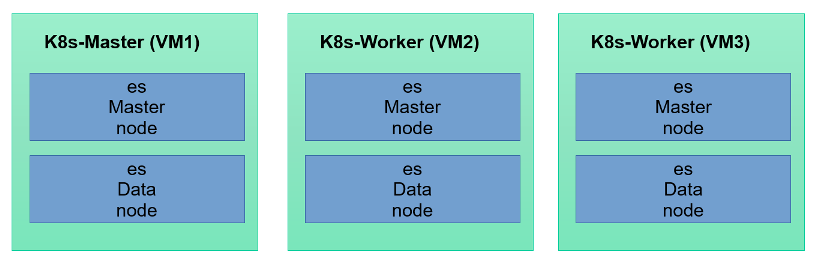
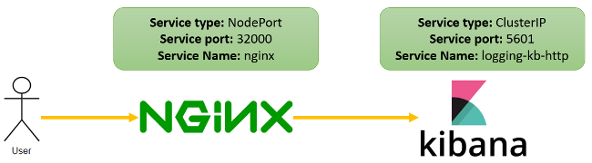
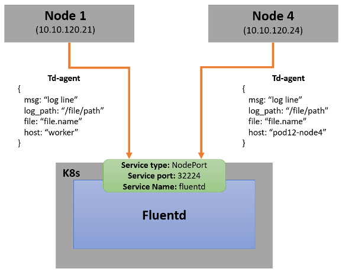
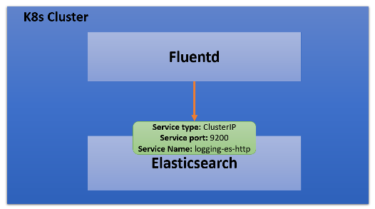

=================
Table of Contents
=================
.. contents::
.. section-numbering::

Setup
======

Prerequisites
-------------------------
- Require 3 VMs to setup K8s
- ``$ sudo yum install ansible``
- ``$ pip install openshift pyyaml kubernetes`` (required for ansible K8s module)
- Update IPs in all these files (if changed)
   ====================================================================== ======================
   Path                                                                   Description
   ====================================================================== ======================
   ``ansible-server/group_vars/all.yml``                                  IP of K8s apiserver and VM hostname
   ``ansible-server/hosts``                                               IP of VMs to install
   ``ansible-server/roles/logging/files/persistentVolume.yaml``           IP of NFS-Server
   ``ansible-server/roles/logging/files/elastalert/ealert-rule-cm.yaml``  IP of alert-receiver
   ====================================================================== ======================

Architecture
--------------


Installation - Clientside
-------------------------

Nodes
`````
- **Node1** = 10.10.120.21
- **Node4** = 10.10.120.24

How installation is done?
`````````````````````````
- TD-agent installation
   ``$ curl -L https://toolbelt.treasuredata.com/sh/install-redhat-td-agent3.sh | sh``
- Copy the TD-agent config file in **Node1**
   ``$ cp tdagent-client-config/node1.conf /etc/td-agent/td-agent.conf``
- Copy the TD-agent config file in **Node4**
   ``$ cp tdagent-client-config/node4.conf /etc/td-agent/td-agent.conf``
- Restart the service
   ``$ sudo service td-agent restart``

Installation - Serverside
-------------------------

Nodes
`````
Inside Jumphost - POD12
   - **VM1** = 10.10.120.211
   - **VM2** = 10.10.120.203
   - **VM3** = 10.10.120.204


How installation is done?
`````````````````````````
**Using Ansible:**
   - **K8s**
      - **Elasticsearch:** 1 Master & 1 Data node at each VM
      - **Kibana:** 1 Replicas
      - **Nginx:** 2 Replicas
      - **Fluentd:** 2 Replicas
      - **Elastalert:** 1 Replica (get duplicate alert, if increase replica)
   - **NFS Server:** at each VM to store elasticsearch data at following path
      - ``/srv/nfs/master``
      - ``/srv/nfs/data``

How to setup?
`````````````
- **To setup K8s cluster and EFK:** Run the ansible-playbook ``ansible/playbooks/setup.yaml``
- **To clean everything:** Run the ansible-playbook ``ansible/playbooks/clean.yaml``

Do we have HA?
````````````````
Yes

Configuration
=============

K8s
---
Path of all yamls (Serverside)
````````````````````````````````
``ansible-server/roles/logging/files/``

K8s namespace
`````````````
``logging``

K8s Service details
````````````````````
``$ kubectl get svc -n logging``

Elasticsearch Configuration
---------------------------

Elasticsearch Setup Structure
`````````````````````````````


Elasticsearch service details
`````````````````````````````
| **Service Name:** ``logging-es-http``
| **Service Port:** ``9200``
| **Service Type:** ``ClusterIP``

How to get elasticsearch default username & password?
`````````````````````````````````````````````````````
- User1 (custom user):
    | **Username:** ``elasticsearch``
    | **Password:** ``password123``
- User2 (by default created by Elastic Operator):
    | **Username:** ``elastic``
    | To get default password:
    | ``$ PASSWORD=$(kubectl get secret -n logging logging-es-elastic-user -o go-template='{{.data.elastic | base64decode}}')``
    | ``$ echo $PASSWORD``

How to increase replica of any index?
````````````````````````````````````````
| $ curl -k -u "elasticsearch:password123" -H 'Content-Type: application/json' -XPUT  "https://10.10.120.211:9200/indexname*/_settings" -d '
| {
|   "index" : {
|   "number_of_replicas" : "2" }
| }'

Index Life
```````````
**30 Days**

Kibana Configuration
--------------------

Kibana Service details
````````````````````````
| **Service Name:** ``logging-kb-http``
| **Service Port:** ``5601``
| **Service Type:** ``ClusterIP``

Nginx Configuration
--------------------
IP
````
https://10.10.120.211:32000

Nginx Setup Structure
`````````````````````


Ngnix Service details
`````````````````````
| **Service Name:** ``nginx``
| **Service Port:** ``32000``
| **Service Type:** ``NodePort``

Why NGINX is used?
```````````````````
`Securing ELK using Nginx <https://logz.io/blog/securing-elk-nginx/>`_

Nginx Configuration
````````````````````
**Path:** ``ansible-server/roles/logging/files/nginx/nginx-conf-cm.yaml``

Fluentd Configuration - Clientside (Td-agent)
---------------------------------------------

Fluentd Setup Structure
````````````````````````


Log collection paths
`````````````````````
- ``/tmp/result*/*.log``
- ``/tmp/result*/*.dat``
- ``/tmp/result*/*.csv``
- ``/tmp/result*/stc-liveresults.dat.*``
- ``/var/log/userspace*.log``
- ``/var/log/sriovdp/*.log.*``
- ``/var/log/pods/**/*.log``

Logs sends to
`````````````
Another fluentd instance of K8s cluster (K8s Master: 10.10.120.211) at Jumphost.

Td-agent logs
`````````````
Path of td-agent logs: ``/var/log/td-agent/td-agent.log``

Td-agent configuration
````````````````````````
| Path of conf file: ``/etc/td-agent/td-agent.conf``
| **If any changes is made in td-agent.conf then restart the td-agent service,** ``$ sudo service td-agent restart``

Config Description
````````````````````
- Get the logs from collection path
- | Convert to this format
  | {
  |   msg: "log line"
  |   log_path: “/file/path”
  |   file: “file.name”
  |   host: “pod12-node4”
  | }
- Sends it to fluentd 

Fluentd Configuration - Serverside
----------------------------------

Fluentd Setup Structure
````````````````````````


Fluentd Service details
````````````````````````
| **Service Name:** ``fluentd``
| **Service Port:** ``32224``
| **Service Type:** ``NodePort``

Logs sends to
`````````````
Elasticsearch service (https://logging-es-http:9200)

Config Description
````````````````````
- **Step 1**
   - Get the logs from Node1 & Node4
- **Step 2**
   ======================================== ======================
   log_path                                 add tag (for routing)
   ======================================== ======================
   ``/tmp/result.*/.*errors.dat``           errordat.log
   ``/tmp/result.*/.*counts.dat``           countdat.log
   ``/tmp/result.*/stc-liveresults.dat.tx`` stcdattx.log
   ``/tmp/result.*/stc-liveresults.dat.rx`` stcdatrx.log
   ``/tmp/result.*/.*Statistics.csv``       ixia.log
   ``/tmp/result.*/vsperf-overall*``        vsperf.log
   ``/tmp/result.*/vswitchd*``              vswitchd.log
   ``/var/log/userspace*``                  userspace.log
   ``/var/log/sriovdp*``                    sriovdp.log
   ``/var/log/pods*``                       pods.log
   ======================================== ======================

- **Step 3**
   Then parse each type using tags. 
    - error.conf: to find any error
    - time-series.conf: to parse time series data
    - time-analysis.conf: to calculate time analyasis
- **Step 4**
   ================================ ======================
   host                             add tag (for routing)
   ================================ ======================
   ``pod12-node4``                  node4
   ``worker``                       node1
   ================================ ======================
- **Step 5**
   ================================ ======================
   Tag                              elasticsearch 
   ================================ ======================
   ``node4``                        index “node4*”
   ``node1``                        index “node1*”
   ================================ ======================

Elastalert
----------

Send alert if
``````````````
- Blacklist
    - "Failed to run test"
    - "Failed to execute in '30' seconds"
    - "('Result', 'Failed')"
    - "could not open socket: connection refused"
    - "Input/output error"
    - "dpdk|ERR|EAL: Error - exiting with code: 1"
    - "Failed to execute in '30' seconds"
    - "dpdk|ERR|EAL: Driver cannot attach the device"
    - "dpdk|EMER|Cannot create lock on"
    - "dpdk|ERR|VHOST_CONFIG: * device not found"
- Time
    - vswitch_duration > 3 sec
    
How to configure alert?
````````````````````````
- Add your rule in ``ansible/roles/logging/files/elastalert/ealert-rule-cm.yaml`` (`Elastalert Rule Config <https://elastalert.readthedocs.io/en/latest/ruletypes.html>`_)
    | name: anything
    | type: <check-above-link> #The RuleType to use
    | index: node4*   #index name
    | realert:
    |   minutes: 0    #to get alert for all cases after each interval
    | alert: post #To send alert as HTTP POST
    | http_post_url: "http://url"
    
- Mount this file to elastalert pod in ``ansible/roles/logging/files/elastalert/elastalert.yaml``.

Alert Format
````````````
{"type": "pattern-match", "label": "failed", "index": "node4-20200815", "log": "error-log-line", "log-path": "/tmp/result/file.log", "reson": "error-message" }

Data Management
===============

Elasticsearch
-------------

Where data is stored now?
`````````````````````````
Data is stored in NFS server with 1 replica of each index (default). Path of data are following:
  - ``/srv/nfs/data (VM1)``
  - ``/srv/nfs/data (VM2)``
  - ``/srv/nfs/data (VM3)``
  - ``/srv/nfs/master (VM1)``
  - ``/srv/nfs/master (VM2)``
  - ``/srv/nfs/master (VM3)``
If user wants to change from NFS to local storage
``````````````````````````````````````````````````
Yes, user can do this, need to configure persistent volume. (``ansible-server/roles/logging/files/persistentVolume.yaml``)

Do we have backup of data?
````````````````````````````
1 replica of each index

When K8s restart, the data is still accessible?
`````````````````````````````````````````````````````
Yes (If data is not deleted from /srv/nfs/data)

Troubleshooting
===============
If no logs receiving in Elasticsearch
--------------------------------------
- Check IP & port of server-fluentd in client config.
- Check client-fluentd logs, ``$ sudo tail -f /var/log/td-agent/td-agent.log``
- Check server-fluentd logs, ``$ sudo kubectl logs -n logging <fluentd-pod-name>``

If no notification received
---------------------------
- Search your "log" in Elasticsearch.
- Check config of elastalert
- Check IP of alert-receiver

Reference
=========
- `Elastic cloud on K8s <https://www.elastic.co/guide/en/cloud-on-k8s/current/k8s-quickstart.html>`_
- `HA Elasticsearch on K8s <https://www.elastic.co/blog/high-availability-elasticsearch-on-kubernetes-with-eck-and-gke>`_
- `Fluentd Configuration <https://docs.fluentd.org/configuration/config-file>`_
- `Elastalert Rule Config <https://elastalert.readthedocs.io/en/latest/ruletypes.html>`_