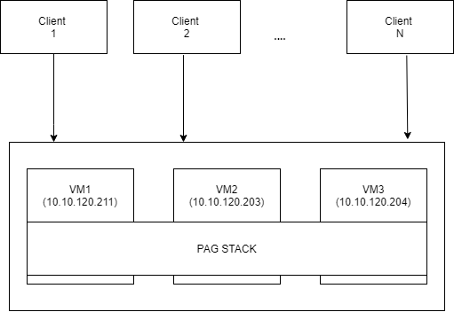
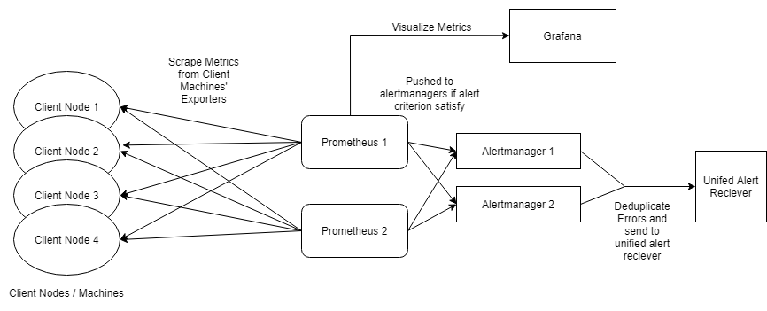

==================
Metrics User Guide
==================

Setup
=======

Prerequisites
-------------------------
- Require 3 VMs to setup K8s
- ``$ sudo yum install ansible``
- ``$ pip install openshift pyyaml kubernetes`` (required for ansible K8s module)
- Update IPs in all these files (if changed)
    - ``ansible-server/group_vars/all.yml`` (IP of apiserver and hostname)
    - ``ansible-server/hosts`` (IP of VMs to install)
    - ``ansible-server/roles/monitoring/files/grafana/grafana-pv.yaml`` (IP of NFS-Server)
    - ``ansible-server/roles/monitoring/files/alertmanager/alertmanager-config.yaml`` (IP of alert-receiver)

Setup Structure
---------------


Installation - Client Side
----------------------------

Nodes
`````
- **Node1** = 10.10.120.21
- **Node4** = 10.10.120.24

How installation is done?
`````````````````````````
Ansible playbook available in ``tools/lma/ansible-client`` folder

- ``cd tools/lma/ansible-client``
- ``ansible-playbook setup.yaml``

This deploys collectd and configures it to send data to collectd exporter
configured at 10.10.120.211 (ip address of current instance of collectd-exporter)
Please make appropriate changes in the config file present in ``tools/lma/ansible-client/roles/collectd/files/``

Installation - Server Side
----------------------------

Nodes
``````

Inside Jumphost - POD12
   - **VM1** = 10.10.120.211
   - **VM2** = 10.10.120.203
   - **VM3** = 10.10.120.204


How installation is done?
`````````````````````````
**Using Ansible:**
   - **K8s**
      - **Prometheus:** 2 independent deployments
      - **Alertmanager:** 2 independent deployments (cluster peers)
      - **Grafana:** 1 Replica deployment
      - **cAdvisor:** 1 daemonset, i.e 3 replicas, one on each node
      - **collectd-exporter:** 1 Replica
      - **node-exporter:** 1 statefulset with 3 replicas
      - **kube-state-metrics:** 1 deployment
   - **NFS Server:** at each VM to store grafana data at following path
      - ``/usr/share/monitoring_data/grafana``

How to setup?
`````````````
- **To setup K8s cluster, EFK and PAG:** Run the ansible-playbook ``ansible/playbooks/setup.yaml``
- **To clean everything:** Run the ansible-playbook ``ansible/playbooks/clean.yaml``

Do we have HA?
````````````````
Yes

Configuration
=============

K8s
---
Path to all yamls (Server Side)
````````````````````````````````
``tools/lma/ansible-server/roles/monitoring/files/``

K8s namespace
`````````````
``monitoring``

Configuration
---------------------------

Serivces and Ports
``````````````````````````

Services and their ports are listed below,
one can go to IP of any node on the following ports,
service will correctly redirect you


  ======================       =======
      Service                   Port
  ======================       =======
     Prometheus                 30900
     Prometheus1                30901
     Main-Prometheus            30902
     Alertmanager               30930
     Alertmanager1              30931
     Grafana                    30000
     Collectd-exporter          30130
  ======================       =======

How to change Configuration?
------------------------------
- Ports, names of the containers, pretty much every configuration can be modified by changing the required values in the respective yaml files (``/tools/lma/ansible-server/roles/monitoring/``)
- For metrics, on the client's machine, edit the collectd's configuration (jinja2 template) file, and add required plugins (``/tools/lma/ansible-client/roles/collectd/files/collectd.conf.j2``).
  For more details refer `this <https://collectd.org/wiki/index.php/First_steps>`_

Where to send metrics?
------------------------

Metrics are sent to collectd exporter.
UDP packets are sent to port 38026
(can be configured and checked at
``tools/lma/ansible-server/roles/monitoring/files/collectd-exporter/collectd-exporter-deployment.yaml``)

Data Management
================================

DataFlow:
--------------


Where is the data stored now?
----------------------------------
  - Grafana data (including dashboards) ==> On master, at ``/usr/share/monitoring_data/grafana`` (its accessed by Presistent volume via NFS)
  - Prometheus Data ==> On VM2 and VM3, at /usr/share/monitoring_data/prometheus

  **Note: Promethei data also are independent of each other, a shared data solution gave errors**

Do we have backup of data?
-------------------------------
  Promethei even though independent scrape same targets,
  have same alert rules, therefore generate very similar data.

  Grafana's NFS part of the data has no backup
  Dashboards' json are available in the ``/tools/lma/metrics/dashboards`` directory

When containers are restarted, the data is still accessible?
-----------------------------------------------------------------
  Yes, unless the data directories are deleted ``(/usr/share/monitoring_data/*)`` from each node

Alert Management
==================

Configure Alert receiver
--------------------------
- Go to file ``/tools/lma/ansible-server/roles/monitoring/files/alertmanager/alertmanager-config.yaml``
- Under the config.yml section under receivers, add, update, delete receivers
- Currently ip of unified alert receiver is used.
- Alertmanager supports multiple types of receivers, you can get a `list here <https://prometheus.io/docs/alerting/latest/configuration/>`_

Add new alerts
--------------------------------------
- Go to file ``/tools/lma/ansible-server/roles/monitoring/files/prometheus/prometheus-config.yaml``
- Under the data section alert.rules file is mounted on the config-map.
- In this file alerts are divided in 4 groups, namely:
        - targets
        - host and hardware
        - container
        - kubernetes
- Add alerts under exisiting group or add new group. Please follow the structure of the file for adding new group
- To add new alert:
    - Use the following structure:

               alert: alertname

               expr: alert rule (generally promql conditional query)

               for: time-range (eg. 5m, 10s, etc, the amount of time the condition needs to be true for the alert to be triggered)

               labels:

                      severity: critical (other severity options and other labels can be added here)

                      type: hardware

               annotations:

                      summary: <summary of the alert>

                      description: <descibe the alert here>

- For an exhaustive alerts list you can have a look `here <https://awesome-prometheus-alerts.grep.to/>`_

Troubleshooting
===============
No metrics received in grafana plot
---------------------------------------------
- Check if all configurations are correctly done.
- Go to main-prometheus's port and any one VMs' ip, and check if prometheus is getting the metrics
- If prometheus is getting them, read grafana's logs (``kubectl -n monitoring logs <name_of_grafana_pod>``)
- Else, have a look at collectd exporter's metrics endpoint (eg. 10.10.120.211:30103/metrics)
- If collectd is getting them, check prometheus's config file if collectd's ip is correct over there.
- Else ssh to master, check which node collectd-exporter is scheduled (lets say vm2)
- Now ssh to vm2
- Use ``tcpdump -i ens3 #the interface used to connect to the internet > testdump``
- Grep your client node's ip and check if packets are reaching our monitoring cluster (``cat testdump | grep <ip of client>``)
- Ideally you should see packets reaching the node, if so please see if the collectd-exporter is running correctly, check its logs.
- If no packets are received, error is on the client side, check collectd's config file and make sure correct collectd-exporter ip is used in the ``<network>`` section.

If no notification received
---------------------------
- Go to main-prometheus's port and any one VMs' ip,(eg. 10.10.120.211:30902) and check if prometheus is getting the metrics
- If no, read "No metrics received in grafana plot" section, else read ahead.
- Check IP of alert-receiver, you can see this by going to alertmanager-ip:port and check if alertmanager is configured correctly.
- If yes, paste the alert rule in the prometheus' query-box and see if any metric staisfy the condition.
- You may need to change alert rules in the alert.rules section of prometheus-config.yaml if there was a bug in the alert's rule. (please read the "Add new alerts" section for detailed instructions)

Reference
=========
- `Prometheus K8S deployment <https://www.metricfire.com/blog/how-to-deploy-prometheus-on-kubernetes/>`_
- `HA Prometheus <https://prometheus.io/docs/introduction/faq/#can-prometheus-be-made-highly-available>`_
- `Data Flow Diagram <https://drive.google.com/file/d/1D--LXFqU_H-fqpD57H3lJFOqcqWHoF0U/view?usp=sharing>`_
- `Collectd Configuration <https://docs.opnfv.org/en/stable-fraser/submodules/barometer/docs/release/userguide/docker.userguide.html#build-the-collectd-docker-image>`_
- `Alertmanager Rule Config <https://awesome-prometheus-alerts.grep.to/>`_
