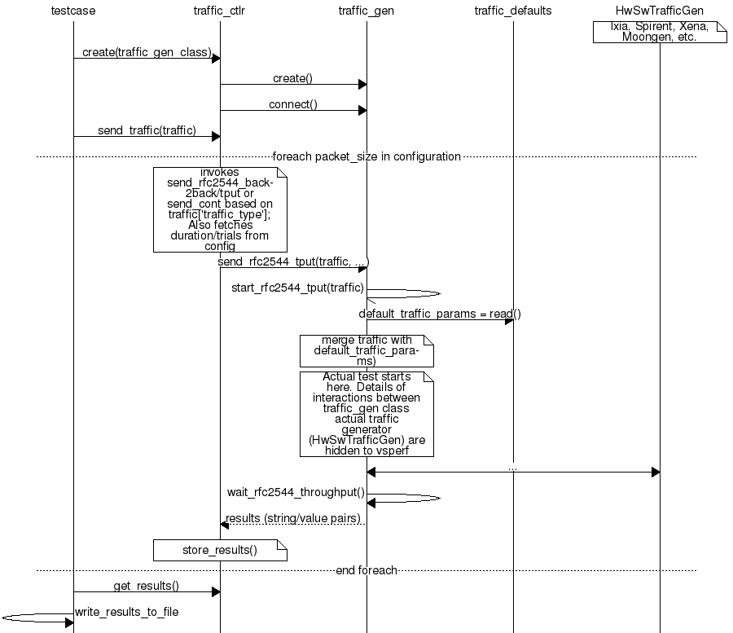
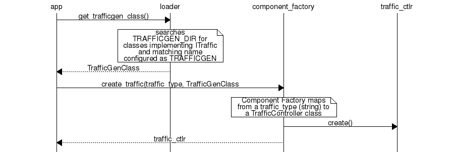

.. This work is licensed under a Creative Commons Attribution 4.0 International License.
.. http://creativecommons.org/licenses/by/4.0
.. (c) OPNFV, Intel Corporation, AT&T and others.

.. _vsperf-design:

======================
VSPERF Design Document
======================

Intended Audience
=================

This document is intended to aid those who want to modify the vsperf code. Or
to extend it - for example to add support for new traffic generators,
deployment scenarios and so on.

Usage
=====

Example Connectivity to DUT
---------------------------

Establish connectivity to the VSPERF DUT Linux host. If this is in an OPNFV lab
following the steps provided by `Pharos <https://www.opnfv.org/community/projects/pharos>`_
to `access the POD <https://wiki.opnfv.org/display/pharos/Pharos+Lab+Support>`_

The followign steps establish the VSPERF environment.

Example Command Lines
---------------------

List all the cli options:

.. code-block:: console

   $ ./vsperf -h

Run all tests that have ``tput`` in their name - ``phy2phy_tput``, ``pvp_tput`` etc.:

.. code-block:: console

   $ ./vsperf --tests 'tput'

As above but override default configuration with settings in '10_custom.conf'.
This is useful as modifying configuration directly in the configuration files
in ``conf/NN_*.py`` shows up as changes under git source control:

.. code-block:: console

   $ ./vsperf --conf-file=<path_to_custom_conf>/10_custom.conf --tests 'tput'

Override specific test parameters. Useful for shortening the duration of tests
for development purposes:

.. code-block:: console

   $ ./vsperf --test-params 'TRAFFICGEN_DURATION=10;TRAFFICGEN_RFC2544_TESTS=1;' \
                            'TRAFFICGEN_PKT_SIZES=(64,)' pvp_tput

Typical Test Sequence
=====================

This is a typical flow of control for a test.

.. image:: vsperf.png

.. _design-configuration:

Configuration
=============

The conf package contains the configuration files (``*.conf``) for all system
components, it also provides a ``settings`` object that exposes all of these
settings.

Settings are not passed from component to component. Rather they are available
globally to all components once they import the conf package.

.. code-block:: python

   from conf import settings
   ...
   log_file = settings.getValue('LOG_FILE_DEFAULT')

Settings files (``*.conf``) are valid python code so can be set to complex
types such as lists and dictionaries as well as scalar types:

.. code-block:: python

   first_packet_size = settings.getValue('PACKET_SIZE_LIST')[0]

Configuration Procedure and Precedence
--------------------------------------

Configuration files follow a strict naming convention that allows them to be
processed in a specific order. All the .conf files are named ``NNx_name.conf``,
where ``NN`` is a decimal number and ``x`` is an optional alphabetical suffix.
The files are processed in order from ``00_name.conf`` to ``99_name.conf``
(and from ``00a_name`` to ``00z_name``), so that if the name setting is given
in both a lower and higher numbered conf file then the higher numbered file
is the effective setting as it is processed after the setting in the lower
numbered file.

The values in the file specified by ``--conf-file`` takes precedence over all
the other configuration files and does not have to follow the naming
convention.

.. _paths-documentation:

Configuration of PATHS dictionary
---------------------------------

VSPERF uses external tools like Open vSwitch and Qemu for execution of testcases. These
tools may be downloaded and built automatically (see :ref:`vsperf-installation-script`)
or installed manually by user from binary packages. It is also possible to use a combination
of both approaches, but it is essential to correctly set paths to all required tools.
These paths are stored within a PATHS dictionary, which is evaluated before execution
of each testcase, in order to setup testcase specific environment. Values selected for testcase
execution are internally stored inside TOOLS dictionary, which is used by VSPERF to execute
external tools, load kernel modules, etc.

The default configuration of PATHS dictionary is spread among three different configuration files
to follow logical grouping of configuration options. Basic description of PATHS dictionary
is placed inside ``conf/00_common.conf``. The configuration specific to DPDK and vswitches
is located at ``conf/02_vswitch.conf``. The last part related to the Qemu is defined inside
``conf/04_vnf.conf``. Default configuration values can be used in case, that all required
tools were downloaded and built automatically by vsperf itself. In case, that some of
tools were installed manually from binary packages, then it will be necessary to modify
the content of PATHS dictionary accordingly.

Dictionary has a specific section of configuration options for every tool type, it means:

    * ``PATHS['vswitch']`` - contains a separate dictionary for each of vswitches supported by VSPEF

      Example:

      .. code-block:: python

         PATHS['vswitch'] = {
            'OvsDpdkVhost': { ... },
            'OvsVanilla' : { ... },
            ...
         }

    * ``PATHS['dpdk']`` - contains paths to the dpdk sources, kernel modules and tools (e.g. testpmd)

      Example:

      .. code-block:: python

         PATHS['dpdk'] = {
            'type' : 'src',
            'src': {
                'path': os.path.join(ROOT_DIR, 'src/dpdk/dpdk/'),
                'modules' : ['uio', os.path.join(RTE_TARGET, 'kmod/igb_uio.ko')],
                'bind-tool': 'tools/dpdk*bind.py',
                'testpmd': os.path.join(RTE_TARGET, 'app', 'testpmd'),
            },
            ...
         }

    * ``PATHS['qemu']`` - contains paths to the qemu sources and executable file

      Example:

      .. code-block:: python

         PATHS['qemu'] = {
             'type' : 'bin',
             'bin': {
                 'qemu-system': 'qemu-system-x86_64'
             },
             ...
         }

Every section specific to the particular vswitch, dpdk or qemu may contain following types
of configuration options:

    * option ``type`` - is a string, which defines the type of configured paths ('src' or 'bin')
      to be selected for a given section:

        * value ``src`` means, that VSPERF will use vswitch, DPDK or QEMU built from sources
          e.g. by execution of ``systems/build_base_machine.sh`` script during VSPERF
          installation

        * value ``bin`` means, that VSPERF will use vswitch, DPDK or QEMU binaries installed
          directly in the operating system, e.g. via OS specific packaging system

    * option ``path`` - is a string with a valid system path; Its content is checked for
      existence, prefixed with section name and stored into TOOLS for later use
      e.g. ``TOOLS['dpdk_src']`` or ``TOOLS['vswitch_src']``

    * option ``modules`` - is list of strings with names of kernel modules; Every module name
      from given list is checked for a '.ko' suffix. In case that it matches and if it is not
      an absolute path to the module, then module name is prefixed with value of ``path``
      option defined for the same section

      Example:

      .. code-block:: python

         """
         snippet of PATHS definition from the configuration file:
         """
         PATHS['vswitch'] = {
             'OvsVanilla' = {
                 'type' : 'src',
                 'src': {
                     'path': '/tmp/vsperf/src_vanilla/ovs/ovs/',
                     'modules' : ['datapath/linux/openvswitch.ko'],
                     ...
                 },
                 ...
             }
             ...
         }

         """
         Final content of TOOLS dictionary used during runtime:
         """
         TOOLS['vswitch_modules'] = ['/tmp/vsperf/src_vanilla/ovs/ovs/datapath/linux/openvswitch.ko']

    * all other options are strings with names and paths to specific tools; If a given string
      contains a relative path and option ``path`` is defined for a given section, then string
      content will be prefixed with content of the ``path``. Otherwise the name of the tool will be
      searched within standard system directories. In case that filename contains OS specific
      wildcards, then they will be expanded to the real path. At the end of the processing, every
      absolute path will be checked for its existence. In case that temporary path (i.e. path with
      a ``_tmp`` suffix) does not exist, then log will be written and vsperf will continue. If any
      other path will not exist, then vsperf execution will be terminated with a runtime error.

      Example:

      .. code-block:: python

         """
         snippet of PATHS definition from the configuration file:
         """
         PATHS['vswitch'] = {
             'OvsDpdkVhost': {
                 'type' : 'src',
                 'src': {
                     'path': '/tmp/vsperf/src_vanilla/ovs/ovs/',
                     'ovs-vswitchd': 'vswitchd/ovs-vswitchd',
                     'ovsdb-server': 'ovsdb/ovsdb-server',
                     ...
                 }
                 ...
             }
             ...
         }

         """
         Final content of TOOLS dictionary used during runtime:
         """
         TOOLS['ovs-vswitchd'] = '/tmp/vsperf/src_vanilla/ovs/ovs/vswitchd/ovs-vswitchd'
         TOOLS['ovsdb-server'] = '/tmp/vsperf/src_vanilla/ovs/ovs/ovsdb/ovsdb-server'

Note: In case that ``bin`` type is set for DPDK, then ``TOOLS['dpdk_src']`` will be set to
the value of ``PATHS['dpdk']['src']['path']``. The reason is, that VSPERF uses downloaded
DPDK sources to copy DPDK and testpmd into the GUEST, where testpmd is built. In case,
that DPDK sources are not available, then vsperf will continue with test execution,
but testpmd can't be used as a guest loopback. This is useful in case, that other guest
loopback applications (e.g. buildin or l2fwd) are used.

Note: In case of RHEL 7.3 OS usage, binary package configuration is required
for Vanilla OVS tests. With the installation of a supported rpm for OVS there is
a section in the ``conf\10_custom.conf`` file that can be used.

.. _configuration-of-traffic-dictionary:

Configuration of TRAFFIC dictionary
-----------------------------------

TRAFFIC dictionary is used for configuration of traffic generator. Default values
can be found in configuration file ``conf/03_traffic.conf``. These default values
can be modified by (first option has the highest priorty):

    1. ``Parameters`` section of testcase definition
    2. command line options specified by ``--test-params`` argument
    3. custom configuration file

It is to note, that in case of option 1 and 2, it is possible to specify only
values, which should be changed. In case of custom configuration file, it is
required to specify whole ``TRAFFIC`` dictionary with its all values or explicitly
call and update() method of ``TRAFFIC`` dictionary.

Detailed description of ``TRAFFIC`` dictionary items follows:

.. code-block:: console

    'traffic_type'  - One of the supported traffic types.
                      E.g. rfc2544_throughput, rfc2544_back2back
                      or rfc2544_continuous
                      Data type: str
                      Default value: "rfc2544_throughput".
    'bidir'         - Specifies if generated traffic will be full-duplex (True)
                      or half-duplex (False)
                      Data type: str
                      Supported values: "True", "False"
                      Default value: "False".
    'frame_rate'    - Defines desired percentage of frame rate used during
                      continuous stream tests.
                      Data type: int
                      Default value: 100.
    'multistream'   - Defines number of flows simulated by traffic generator.
                      Value 0 disables multistream feature
                      Data type: int
                      Supported values: 0-65536 for 'L4' stream type
                                        unlimited for 'L2' and 'L3' stream types
                      Default value: 0.
    'stream_type'   - Stream type is an extension of the "multistream" feature.
                      If multistream is disabled, then stream type will be
                      ignored. Stream type defines ISO OSI network layer used
                      for simulation of multiple streams.
                      Data type: str
                      Supported values:
                         "L2" - iteration of destination MAC address
                         "L3" - iteration of destination IP address
                         "L4" - iteration of destination port
                                of selected transport protocol
                      Default value: "L4".
    'pre_installed_flows'
                   -  Pre-installed flows is an extension of the "multistream"
                      feature. If enabled, it will implicitly insert a flow
                      for each stream. If multistream is disabled, then
                      pre-installed flows will be ignored.
                      Note: It is supported only for p2p deployment scenario.
                      Data type: str
                      Supported values:
                         "Yes" - flows will be inserted into OVS
                         "No"  - flows won't be inserted into OVS
                      Default value: "No".
    'flow_type'     - Defines flows complexity.
                      Data type: str
                      Supported values:
                         "port" - flow is defined by ingress ports
                         "IP"   - flow is defined by ingress ports
                                  and src and dst IP addresses
                      Default value: "port"
    'flow_control'  - Controls flow control support by traffic generator.
                      Supported values:
                         False  - flow control is disabled
                         True   - flow control is enabled
                      Default value: False
                      Note: Currently it is supported by IxNet only
    'learning_frames' - Controls learning frames support by traffic generator.
                      Supported values:
                         False  - learning frames are disabled
                         True   - learning frames are enabled
                      Default value: True
                      Note: Currently it is supported by IxNet only
    'l2'            - A dictionary with l2 network layer details. Supported
                      values are:
        'srcmac'    - Specifies source MAC address filled by traffic generator.
                      NOTE: It can be modified by vsperf in some scenarios.
                      Data type: str
                      Default value: "00:00:00:00:00:00".
        'dstmac'    - Specifies destination MAC address filled by traffic generator.
                      NOTE: It can be modified by vsperf in some scenarios.
                      Data type: str
                      Default value: "00:00:00:00:00:00".
        'framesize' - Specifies default frame size. This value should not be
                      changed directly. It will be overridden during testcase
                      execution by values specified by list TRAFFICGEN_PKT_SIZES.
                      Data type: int
                      Default value: 64
    'l3'            - A dictionary with l3 network layer details. Supported
                      values are:
        'enabled'   - Specifies if l3 layer should be enabled or disabled.
                      Data type: bool
                      Default value: True
                      NOTE: Supported only by IxNet trafficgen class
        'srcip'     - Specifies source MAC address filled by traffic generator.
                      NOTE: It can be modified by vsperf in some scenarios.
                      Data type: str
                      Default value: "1.1.1.1".
        'dstip'     - Specifies destination MAC address filled by traffic generator.
                      NOTE: It can be modified by vsperf in some scenarios.
                      Data type: str
                      Default value: "90.90.90.90".
        'proto'     - Specifies deflaut protocol type.
                      Please check particular traffic generator implementation
                      for supported protocol types.
                      Data type: str
                      Default value: "udp".
    'l4'            - A dictionary with l4 network layer details. Supported
                      values are:
        'enabled'   - Specifies if l4 layer should be enabled or disabled.
                      Data type: bool
                      Default value: True
                      NOTE: Supported only by IxNet trafficgen class
        'srcport'   - Specifies source port of selected transport protocol.
                      NOTE: It can be modified by vsperf in some scenarios.
                      Data type: int
                      Default value: 3000
        'dstport'   - Specifies destination port of selected transport protocol.
                      NOTE: It can be modified by vsperf in some scenarios.
                      Data type: int
                      Default value: 3001
    'vlan'          - A dictionary with vlan encapsulation details. Supported
                      values are:
        'enabled'   - Specifies if vlan encapsulation should be enabled or
                      disabled.
                      Data type: bool
                      Default value: False
        'id'        - Specifies vlan id.
                      Data type: int (NOTE: must fit to 12 bits)
                      Default value: 0
        'priority'  - Specifies a vlan priority (PCP header field).
                      Data type: int (NOTE: must fit to 3 bits)
                      Default value: 0
        'cfi'       - Specifies if frames can or cannot be dropped during
                      congestion (DEI header field).
                      Data type: int (NOTE: must fit to 1 bit)
                      Default value: 0

.. _configuration-of-guest-options:

Configuration of GUEST options
------------------------------

VSPERF is able to setup scenarios involving a number of VMs in series or in parallel.
All configuration options related to a particular VM instance are defined as
lists and prefixed with ``GUEST_`` label. It is essential, that there is enough
items in all ``GUEST_`` options to cover all VM instances involved in the test.
In case there is not enough items, then VSPERF will use the first item of
particular ``GUEST_`` option to expand the list to required length.

Example of option expansion for 4 VMs:

    .. code-block:: python

       """
       Original values:
       """
       GUEST_SMP = ['2']
       GUEST_MEMORY = ['2048', '4096']

       """
       Values after automatic expansion:
       """
       GUEST_SMP = ['2', '2', '2', '2']
       GUEST_MEMORY = ['2048', '4096', '2048', '2048']

First option can contain macros starting with ``#`` to generate VM specific values.
These macros can be used only for options of ``list`` or ``str`` types with ``GUEST_``
prefix.

Example of macros and their expansion for 2 VMs:

    .. code-block:: python

       """
       Original values:
       """
       GUEST_SHARE_DIR = ['/tmp/qemu#VMINDEX_share']
       GUEST_BRIDGE_IP = ['#IP(1.1.1.5)/16']

       """
       Values after automatic expansion:
       """
       GUEST_SHARE_DIR = ['/tmp/qemu0_share', '/tmp/qemu1_share']
       GUEST_BRIDGE_IP = ['1.1.1.5/16', '1.1.1.6/16']

Additional examples are available at ``04_vnf.conf``.

Note: In  case, that macro is detected in the first item of the list, then
all other items are ignored and list content is created automatically.

Multiple macros can be used inside one configuration option definition, but macros
cannot be used inside other macros. The only exception is macro ``#VMINDEX``, which
is expanded first and thus it can be used inside other macros.

Following macros are supported:

  * ``#VMINDEX`` - it is replaced by index of VM being executed; This macro
    is expanded first, so it can be used inside other macros.

    Example:

    .. code-block:: python

       GUEST_SHARE_DIR = ['/tmp/qemu#VMINDEX_share']

  * ``#MAC(mac_address[, step])`` - it will iterate given ``mac_address``
    with optional ``step``. In case that step is not defined, then it is set to 1.
    It means, that first VM will use the value of ``mac_address``, second VM
    value of ``mac_address`` increased by ``step``, etc.

    Example:

    .. code-block:: python

       GUEST_NICS = [[{'mac' : '#MAC(00:00:00:00:00:01,2)'}]]

  * ``#IP(ip_address[, step])`` - it will iterate given ``ip_address``
    with optional ``step``. In case that step is not defined, then it is set to 1.
    It means, that first VM will use the value of ``ip_address``, second VM
    value of ``ip_address`` increased by ``step``, etc.

    Example:

    .. code-block:: python

       GUEST_BRIDGE_IP = ['#IP(1.1.1.5)/16']

  * ``#EVAL(expression)`` - it will evaluate given ``expression`` as python code;
    Only simple expressions should be used. Call of the functions is not supported.

    Example:

    .. code-block:: python

       GUEST_CORE_BINDING = [('#EVAL(6+2*#VMINDEX)', '#EVAL(7+2*#VMINDEX)')]

Other Configuration
-------------------

``conf.settings`` also loads configuration from the command line and from the environment.

.. _pxp-deployment:

PXP Deployment
==============

Every testcase uses one of the supported deployment scenarios to setup test environment.
The controller responsible for a given scenario configures flows in the vswitch to route
traffic among physical interfaces connected to the traffic generator and virtual
machines. VSPERF supports several deployments including PXP deployment, which can
setup various scenarios with multiple VMs.

These scenarios are realized by VswitchControllerPXP class, which can configure and
execute given number of VMs in serial or parallel configurations. Every VM can be
configured with just one or an even number of interfaces. In case that VM has more than
2 interfaces, then traffic is properly routed among pairs of interfaces.

Example of traffic routing for VM with 4 NICs in serial configuration:

.. code-block:: console

                 +------------------------------------------+
                 |  VM with 4 NICs                          |
                 |  +---------------+    +---------------+  |
                 |  |  Application  |    |  Application  |  |
                 |  +---------------+    +---------------+  |
                 |      ^       |            ^       |      |
                 |      |       v            |       v      |
                 |  +---------------+    +---------------+  |
                 |  | logical ports |    | logical ports |  |
                 |  |   0       1   |    |   2       3   |  |
                 +--+---------------+----+---------------+--+
                        ^       :            ^       :
                        |       |            |       |
                        :       v            :       v
        +-----------+---------------+----+---------------+----------+
        | vSwitch   |   0       1   |    |   2       3   |          |
        |           | logical ports |    | logical ports |          |
        | previous  +---------------+    +---------------+   next   |
        | VM or PHY     ^       |            ^       |     VM or PHY|
        |   port   -----+       +------------+       +--->   port   |
        +-----------------------------------------------------------+

It is also possible to define different number of interfaces for each VM to better
simulate real scenarios.

Example of traffic routing for 2 VMs in serial configuration, where 1st VM has
4 NICs and 2nd VM 2 NICs:

.. code-block:: console

           +------------------------------------------+  +---------------------+
           |  1st VM with 4 NICs                      |  |  2nd VM with 2 NICs |
           |  +---------------+    +---------------+  |  |  +---------------+  |
           |  |  Application  |    |  Application  |  |  |  |  Application  |  |
           |  +---------------+    +---------------+  |  |  +---------------+  |
           |      ^       |            ^       |      |  |      ^       |      |
           |      |       v            |       v      |  |      |       v      |
           |  +---------------+    +---------------+  |  |  +---------------+  |
           |  | logical ports |    | logical ports |  |  |  | logical ports |  |
           |  |   0       1   |    |   2       3   |  |  |  |   0       1   |  |
           +--+---------------+----+---------------+--+  +--+---------------+--+
                  ^       :            ^       :               ^       :
                  |       |            |       |               |       |
                  :       v            :       v               :       v
  +-----------+---------------+----+---------------+-------+---------------+----------+
  | vSwitch   |   0       1   |    |   2       3   |       |   4       5   |          |
  |           | logical ports |    | logical ports |       | logical ports |          |
  | previous  +---------------+    +---------------+       +---------------+   next   |
  | VM or PHY     ^       |            ^       |               ^       |     VM or PHY|
  |   port   -----+       +------------+       +---------------+       +---->  port   |
  +-----------------------------------------------------------------------------------+

The number of VMs involved in the test and the type of their connection is defined
by deployment name as follows:

  * ``pvvp[number]`` - configures scenario with VMs connected in series with
    optional ``number`` of VMs. In case that ``number`` is not specified, then
    2 VMs will be used.

    Example of 2 VMs in a serial configuration:

    .. code-block:: console

       +----------------------+  +----------------------+
       |   1st VM             |  |   2nd VM             |
       |   +---------------+  |  |   +---------------+  |
       |   |  Application  |  |  |   |  Application  |  |
       |   +---------------+  |  |   +---------------+  |
       |       ^       |      |  |       ^       |      |
       |       |       v      |  |       |       v      |
       |   +---------------+  |  |   +---------------+  |
       |   | logical ports |  |  |   | logical ports |  |
       |   |   0       1   |  |  |   |   0       1   |  |
       +---+---------------+--+  +---+---------------+--+
               ^       :                 ^       :
               |       |                 |       |
               :       v                 :       v
       +---+---------------+---------+---------------+--+
       |   |   0       1   |         |   3       4   |  |
       |   | logical ports | vSwitch | logical ports |  |
       |   +---------------+         +---------------+  |
       |       ^       |                 ^       |      |
       |       |       +-----------------+       v      |
       |   +----------------------------------------+   |
       |   |              physical ports            |   |
       |   |      0                         1       |   |
       +---+----------------------------------------+---+
                  ^                         :
                  |                         |
                  :                         v
       +------------------------------------------------+
       |                                                |
       |                traffic generator               |
       |                                                |
       +------------------------------------------------+

  * ``pvpv[number]`` - configures scenario with VMs connected in parallel with
    optional ``number`` of VMs. In case that ``number`` is not specified, then
    2 VMs will be used. Multistream feature is used to route traffic to particular
    VMs (or NIC pairs of every VM). It means, that VSPERF will enable multistream
    feature and sets the number of streams to the number of VMs and their NIC
    pairs. Traffic will be dispatched based on Stream Type, i.e. by UDP port,
    IP address or MAC address.

    Example of 2 VMs in a parallel configuration, where traffic is dispatched
        based on the UDP port.

    .. code-block:: console

       +----------------------+  +----------------------+
       |   1st VM             |  |   2nd VM             |
       |   +---------------+  |  |   +---------------+  |
       |   |  Application  |  |  |   |  Application  |  |
       |   +---------------+  |  |   +---------------+  |
       |       ^       |      |  |       ^       |      |
       |       |       v      |  |       |       v      |
       |   +---------------+  |  |   +---------------+  |
       |   | logical ports |  |  |   | logical ports |  |
       |   |   0       1   |  |  |   |   0       1   |  |
       +---+---------------+--+  +---+---------------+--+
               ^       :                 ^       :
               |       |                 |       |
               :       v                 :       v
       +---+---------------+---------+---------------+--+
       |   |   0       1   |         |   3       4   |  |
       |   | logical ports | vSwitch | logical ports |  |
       |   +---------------+         +---------------+  |
       |      ^         |                 ^       :     |
       |      |     ......................:       :     |
       |  UDP | UDP :   |                         :     |
       |  port| port:   +--------------------+    :     |
       |   0  |  1  :                        |    :     |
       |      |     :                        v    v     |
       |   +----------------------------------------+   |
       |   |              physical ports            |   |
       |   |    0                               1   |   |
       +---+----------------------------------------+---+
                ^                               :
                |                               |
                :                               v
       +------------------------------------------------+
       |                                                |
       |                traffic generator               |
       |                                                |
       +------------------------------------------------+

PXP deployment is backward compatible with PVP deployment, where ``pvp`` is
an alias for ``pvvp1`` and it executes just one VM.

The number of interfaces used by VMs is defined by configuration option
``GUEST_NICS_NR``. In case that more than one pair of interfaces is defined
for VM, then:

    * for ``pvvp`` (serial) scenario every NIC pair is connected in serial
      before connection to next VM is created
    * for ``pvpv`` (parallel) scenario every NIC pair is directly connected
      to the physical ports and unique traffic stream is assigned to it

Examples:

    * Deployment ``pvvp10`` will start 10 VMs and connects them in series
    * Deployment ``pvpv4`` will start 4 VMs and connects them in parallel
    * Deployment ``pvpv1`` and GUEST_NICS_NR = [4] will start 1 VM with
      4 interfaces and every NIC pair is directly connected to the
      physical ports
    * Deployment ``pvvp`` and GUEST_NICS_NR = [2, 4] will start 2 VMs;
      1st VM will have 2 interfaces and 2nd VM 4 interfaces. These interfaces
      will be connected in serial, i.e. traffic will flow as follows:
      PHY1 -> VM1_1 -> VM1_2 -> VM2_1 -> VM2_2 -> VM2_3 -> VM2_4 -> PHY2

Note: In case that only 1 or more than 2 NICs are configured for VM,
then ``testpmd`` should be used as forwarding application inside the VM.
As it is able to forward traffic between multiple VM NIC pairs.

Note: In case of ``linux_bridge``, all NICs are connected to the same
bridge inside the VM.

VM, vSwitch, Traffic Generator Independence
===========================================

VSPERF supports different VSwitches, Traffic Generators, VNFs
and Forwarding Applications by using standard object-oriented polymorphism:

  * Support for vSwitches is implemented by a class inheriting from IVSwitch.
  * Support for Traffic Generators is implemented by a class inheriting from
    ITrafficGenerator.
  * Support for VNF is implemented by a class inheriting from IVNF.
  * Support for Forwarding Applications is implemented by a class inheriting
    from IPktFwd.

By dealing only with the abstract interfaces the core framework can support
many implementations of different vSwitches, Traffic Generators, VNFs
and Forwarding Applications.

IVSwitch
--------

.. code-block:: python

    class IVSwitch:
      start(self)
      stop(self)
      add_switch(switch_name)
      del_switch(switch_name)
      add_phy_port(switch_name)
      add_vport(switch_name)
      get_ports(switch_name)
      del_port(switch_name, port_name)
      add_flow(switch_name, flow)
      del_flow(switch_name, flow=None)

ITrafficGenerator
-----------------

.. code-block:: python

    class ITrafficGenerator:
      connect()
      disconnect()

      send_burst_traffic(traffic, numpkts, time, framerate)

      send_cont_traffic(traffic, time, framerate)
      start_cont_traffic(traffic, time, framerate)
      stop_cont_traffic(self):

      send_rfc2544_throughput(traffic, tests, duration, lossrate)
      start_rfc2544_throughput(traffic, tests, duration, lossrate)
      wait_rfc2544_throughput(self)

      send_rfc2544_back2back(traffic, tests, duration, lossrate)
      start_rfc2544_back2back(traffic, , tests, duration, lossrate)
      wait_rfc2544_back2back()

Note ``send_xxx()`` blocks whereas ``start_xxx()`` does not and must be followed by a subsequent call to ``wait_xxx()``.

IVnf
----

.. code-block:: python

    class IVnf:
      start(memory, cpus,
            monitor_path, shared_path_host,
            shared_path_guest, guest_prompt)
      stop()
      execute(command)
      wait(guest_prompt)
      execute_and_wait (command)

IPktFwd
--------

  .. code-block:: python

    class IPktFwd:
        start()
        stop()

Controllers
-----------

Controllers are used in conjunction with abstract interfaces as way
of decoupling the control of vSwtiches, VNFs, TrafficGenerators
and Forwarding Applications from other components.

The controlled classes provide basic primitive operations. The Controllers
sequence and co-ordinate these primitive operation in to useful actions. For
instance the vswitch_controller_p2p can be used to bring any vSwitch (that
implements the primitives defined in IVSwitch) into the configuration required
by the Phy-to-Phy  Deployment Scenario.

In order to support a new vSwitch only a new implementation of IVSwitch needs
be created for the new vSwitch to be capable of fulfilling all the Deployment
Scenarios provided for by existing or future vSwitch Controllers.

Similarly if a new Deployment Scenario is required it only needs to be written
once as a new vSwitch Controller and it will immediately be capable of
controlling all existing and future vSwitches in to that Deployment Scenario.

Similarly the Traffic Controllers can be used to co-ordinate basic operations
provided by implementers of ITrafficGenerator to provide useful tests. Though
traffic generators generally already implement full test cases i.e. they both
generate suitable traffic and analyse returned traffic in order to implement a
test which has typically been predefined in an RFC document. However the
Traffic Controller class allows for the possibility of further enhancement -
such as iterating over tests for various packet sizes or creating new tests.

Traffic Controller's Role
-------------------------

Loader & Component Factory
--------------------------

The working of the Loader package (which is responsible for *finding* arbitrary
classes based on configuration data) and the Component Factory which is
responsible for *choosing* the correct class for a particular situation - e.g.
Deployment Scenario can be seen in this diagram.

Routing Tables
==============

Vsperf uses a standard set of routing tables in order to allow tests to easily
mix and match Deployment Scenarios (PVP, P2P topology), Tuple Matching and
Frame Modification requirements.

.. code-block:: console

      +--------------+
      |              |
      | Table 0      |  table#0 - Match table. Flows designed to force 5 & 10
      |              |  tuple matches go here.
      |              |
      +--------------+
             |
             |
             v
      +--------------+  table#1 - Routing table. Flow entries to forward
      |              |  packets between ports goes here.
      | Table 1      |  The chosen port is communicated to subsequent tables by
      |              |  setting the metadata value to the egress port number.
      |              |  Generally this table is set-up by by the
      +--------------+  vSwitchController.
             |
             |
             v
      +--------------+  table#2 - Frame modification table. Frame modification
      |              |  flow rules are isolated in this table so that they can
      | Table 2      |  be turned on or off without affecting the routing or
      |              |  tuple-matching flow rules. This allows the frame
      |              |  modification and tuple matching required by the tests
      |              |  in the VSWITCH PERFORMANCE FOR TELCO NFV test
      +--------------+  specification to be independent of the Deployment
             |          Scenario set up by the vSwitchController.
             |
             v
      +--------------+
      |              |
      | Table 3      |  table#3 - Egress table. Egress packets on the ports
      |              |  setup in Table 1.
      +--------------+

