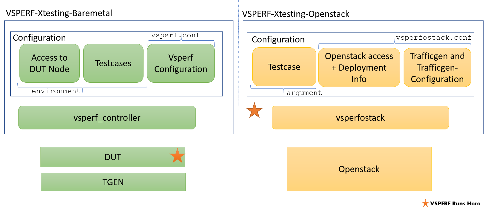

.. This work is licensed under a Creative Commons Attribution 4.0 International License.
.. http://creativecommons.org/licenses/by/4.0
.. (c) OPNFV, Spirent, AT&T, Ixia  and others.

.. OPNFV VSPERF Documentation master file.

********************************
OPNFV VSPERF with OPNFV Xtesting
********************************

============
Introduction
============
User can use VSPERF with Xtesting for two different usecases.

1. Baremetal Dataplane Testing/Benchmarking.
2. Openstack Dataplane Testing/Benchmarking.

The Baremetal usecase is the legacy usecase of OPNFV VSPERF.

The below figure summarizes both the usecases.

===========
How to Use?
===========

Step-1: Build the container
^^^^^^^^^^^^^^^^^^^^^^^^^^^
Go the xtesting/baremetal or xtesting/openstack and run the following command.

.. code-block:: console

  docker build -t 127.0.0.1:5000/vsperfbm

Step-2: Install and run Xtesting Playbook
^^^^^^^^^^^^^^^^^^^^^^^^^^^^^^^^^^^^^^^^^

These commands are described in OPNFV Xtesting Documentation. Please refere to OPNFV Xtesting wiki for description of these commands.

.. code-block:: console

  virtualenv xtesting
  . xtesting/bin/activate
  ansible-galaxy install collivier.xtesting
  ansible-playbook site.yml

======================
Accessing the Results?
======================

VSPERF automatically publishes the results to any OPNFV Testapi deployment.
User has to configure following two parameters in VSPERF.

1. OPNFVPOD - The name of the pod.
2. OPNFV_URL - The endpoint serving testapi.

As Xtesting runs its own testapi, user should point to this (testapi endpoint of Xtesting) using the above two configuration.

NOTE: Before running the test, it would help if user can prepre the testapi of Xtesting (if needed). The preparation include setting up the following:

1. Projects
2. Testcases.
3. Pods.

Please refer to the documentation of testapi for more details.

=======================================
Accessing other components of Xtesting?
=======================================

Please refer to the documentation of Xtesting in OPNFV Wiki.
